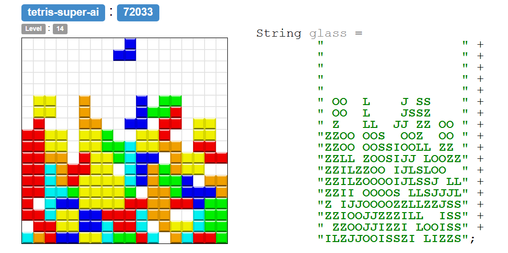

<meta charset="UTF-8">

## Вступление

Игровой demo-сервер доступен так же в интернете 24/7 в целях
ознакомления [http://codenjoy.com/codenjoy-contest](http://codenjoy.com/codenjoy-contest).

Игра с открытым исходным кодом. Для реализации своей игры, исправления
ошибок в текущей и внесения других правок необходимо для начала
[форкнуть проект](https://github.com/codenjoyme/codenjoy.git).
В корне репозитория есть описание в файле Readme.md - там описано, что делать дальше.

По возникающим вопросам, пиши в [skype alexander.baglay](skype:alexander.baglay)
или на почту [apofig@gmail.com](mailto:apofig@gmail.com).

## В чем суть игры?

Надо написать своего бота, который обыграет других ботов
по очкам в тетрис.

Каждый участник играет на своем поле. Играющий может
двигать фигуркой влево и вправо, вращать ее и приземлять.
Все так же, как в классическом тетрисе с одной лишь разницей - фигурки
появляются не сразу: как только ты научишься укладывать "квадратики",
появятся "палочки" и так далее, пока тебе не откроются все фигурки.

Чем дальше ты заходишь, тем больше очков зарабатываешь.
Чтобы перейти на следующий уровень тебе необходимо укладывать
фигурки компактно, чтобы образовывались сплошные линии (от стенки к стенке),
которые затем "снимаются" (удаляются) с начислением бонусных очков.

## Подключение к серверу

Итак, игрок [регистрируется на сервере](../../../register?gameName=tetris),
указывая свой email.

Далее необходимо подключиться [из кода](../../../resources/tetris/user/clients.zip)
к серверу через websocket. Это Maven проект и подойдет он для игры на JVM языках.
Как его запустить смотри в корне проекта в файле README.txt

Кроме того поддерживаются и другие языки программирования - их исходники находятся в том же архиве.

Адрес для подключения к игре на сервере http://codenjoy.com:

`ws://codenjoy.com:80/codenjoy-contest/ws?user=[user]&code=[code]`

Адрес для подключения к игре на сервере, развернутом в локальной сети:

`ws://[server]:8080/codenjoy-contest/ws?user=[user]&code=[code]`

Тут `[server]` - домен или ip-адрес игрового сервера, `[user]` - id игрока, a `[code]` -
твой security token, его ты можешь получить из адресной
строки браузера после регистрации/логина.

## Формат сообщений

После подключения клиент будет регулярно (каждую секунду) получать строку
символов в формате JSON — с закодированным состоянием стакана. Формат таков:

<pre>{
  'currentFigurePoint':{'x':4,'y':9},
  'currentFigureType':'O',
  'futureFigures':['S', 'Z', 'I', 'O'],
  'layers':[
    '..................
    ........OO........
    ........OO........
    ..................
    ..................
    ..................
    ..................
    ..................
    ..................
    ..................
    ..................
    ..................
    ..................
    ..................
    ..I...............
    ..I......OO.......
    ..IOO..SSOOZZ.....
    ..IOO.SSIIIIZZ....'
  ]
}</pre>

Параметр `currentFigurePoint` содержит координату новой фигурки.
`[0, 0]` - левый нижний угол.

У каждой фигурки есть своя точка вращения

Параметр `currentFigureType` содержит тип новой фигурки.

Параметр `futureFigures` говорит о последующих фигурках,
которые появятся после текущей.

Параметр `layers` содержит массив из одной строчки, которая содержит закодированное содержимое стакана.
Длинна строки `layers[0]` равна площади поля (18 на 18 символов). Если вставить символ переноса
строки каждые `sqrt(length(string))` символов, то получится читабельное
изображение стакана.

<pre>..................
........OO........
........OO........
..................
..................
..................
..................
..................
..................
..................
..................
..................
..................
..................
..I...............
..I......OO.......
..IOO..SSOOZZ.....
..IOO.SSIIIIZZ....</pre>

Первый символ строки соответствует ячейке расположенной в 
левом верхнем углу и имеет координату `[0, 17]`.

## Расшифровка символов

Расшифровку символов ты можешь [найти тут](elements.md).

## Как играть?

Игра пошаговая, каждую секунду сервер посылает твоему клиенту
состояние обновленного стакана на текущий момент и ожидает ответа.
За следующую секунду алгоритм игрока должен успеть принять решение,
куда направить фигурку. Если алгоритм не успел — фигурка падает на 1 клетку вниз.

Твоя цель отгадывать цифры в соответствии с задуманным тобой алгоритмом.
Играк на поле должен уметь зарабатывать так много очков, как только сможет.
Основная цель игры - обыграть по очкам всех соперников.

## Команды управления

Команд несколько:

* `LEFT, RIGHT` – передвижение фигурки влево/вправо.
* `DOWN` - приземление фигурки.
* `ACT` - вращение фигурки по часовой стрелке на 90 градусов.
* `ACT(2)` - вращение на 180 градусов.
* `ACT(3)` - вращение против часовой стрелки на 90 градусов.
* `ACT(0,0)` - обнуление стакана (как и при его переполнении будут сняты штрафные очки).

* Команды движения/вращения/приземления можно комбинировать, разделяя их
через запятую – это значит что за один тик игры будет выполнена заданная цепочка команд.

## Настройки

Всего предусмотрено несколько бонусных и одни штрафные очки.

За одну приземленную фигуру ты получаешь количество очков, равное ее сложности.
Сложность фигурок возрастает:

* `O`  - 1 очко[*](index.md#ask)
* `I` - 2 очка[*](index.md#ask)
* `J` - 3 очка[*](index.md#ask)
* `L` - 4 очка[*](index.md#ask)
* `S` - 5 очков[*](index.md#ask)
* `Z` - 6 очков[*](index.md#ask)
* `T` - 7 очков[*](index.md#ask)

Фигуры могут появляться в этой последовательности 
с каждым новым уровнем все чаще, а могут и в другом порядке - 
как именно решает Сенсей[*](index.md#ask).

За "снятые" линии ты будешь получать больше бонусных очков[*](index.md#ask).
Чем больше одновременно снятых линий - тем выгоднее. Например:

* за 1 "снятую" линию ты получишь `10*level` очков[*](index.md#ask)
* за 2 "снятые" линии ты получишь уже `30*level` очков[*](index.md#ask)
* за 3 "снятые" линии - `50*level` очков[*](index.md#ask)
* за 4 "снятые" линии - `100*level` очков[*](index.md#ask) 

Тут level - уровень до которого ты дошел.

Так же не стоит забывать про штрафные очки. За каждый переполненный стакан
(или если ты обнулишь его сам) ты потеряешь `10*level` заработанных 
очков[*](index.md#ask).

Победит тот участник, кто соберет больше всего очков за ограниченное 
количество времени.

За деталями обращайся к Сенсею, вполне возможно, что эти константы,
а так же правила определения финалиста будут изменены[*](index.md#ask).

## Клиент

Но если [клиент](../../../resources/tetris/user/clients.zip)
реализован на твоем языке программирования -
у тебя будет возможность использовать более высокоуровневое API:
`Board` - инкапсулирующий JSON состояние игры, и `GlassBoard` -
с полезными методами для анализа свободных и занятых мест в стакане;
и `YourSolver` - пустой класс одним методом `getAnswer(Board board)` - 
его тебе и предстоит наполнить умной логикой. Ты так же можешь расширять
новыми методами на свое усмотрение классы `Board` и `GlassBoard`.

Прежде всего тебе предстоит выбрать язык программирования.
После открыть WebSocket клиент в IDE и запустить его.
Детали читай в Readme.txt в корне проекта.
Проследуя инструкциям ты подключишься к серверу.
Затем тебе предстоит заставить падающие фигурки слушаться твои команды,
вести осмысленную игру и победить.

## Хочешь провести ивент у себя?

Игра с открытым исходным кодом. Для реализации своей игры, исправления
ошибок в текущей и внесения других правок необходимо для начала
[форкнуть проект](https://github.com/codenjoyme/codenjoy.git).
В корне репозитория есть описание в файле Readme.md - там описано, что делать дальше.

По возникающим вопросам, пиши в skype [alexander.baglay](skype:alexander.baglay)
или на почту [apofig@gmail.com](mailto:apofig@gmail.com).